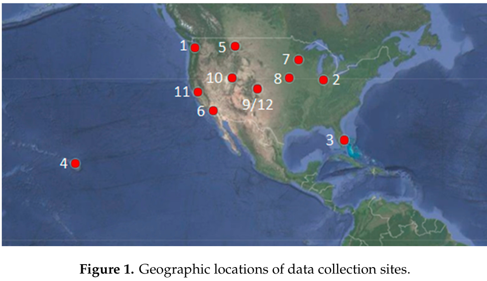

# Dataset Overview

This project uses a **solar power generation dataset** originally utilized by Pasion et al. (2020), collected from **12 geographically diverse locations** across Department of Defense (DoD) installations within 25 climate regions.  
These sites were strategically selected using **climate classification matrices** and **Pareto analysis** to ensure coverage of distinct environmental conditions across the United States and surrounding territories.

*Figure 1. Geographic locations of data collection sites.*

---

## 🌤️ Variables and Descriptions

| Variable | Description | Reason for Inclusion |
|-----------|--------------|----------------------|
| **Cloud Ceiling** | Measures altitude of significant cloud coverage. | Indicates how much sunlight reaches PV panels. |
| **Latitude** | Geographic coordinate of the installation site. | Determines sunlight angle and intensity. |
| **Month / Hour** | Temporal variables. | Capture daily and seasonal solar variations. |
| **Humidity** | Amount of water vapor in the air. | Influences refraction, dust, and panel cleanliness. |
| **Temperature** | Ambient air temperature. | Affects PV efficiency (higher temps → lower output). |
| **Wind Speed** | Airflow rate near PV panels. | Affects cooling and dust accumulation. |
| **Visibility** | Atmospheric clarity measure. | Impacts irradiance reaching panels. |
| **Pressure** | Atmospheric pressure. | Helps anticipate weather changes influencing PV output. |
| **Altitude** | Height above sea level. | Impacts air density and irradiance intensity. |

---

## ⚙️ Data Origin

The dataset was collected by **UCAR Center for Science Education (2020)** and first introduced in:

> Pasion, C., et al. (2020). *A Queueing Model for Video Analytics Applications of Smart Cities.*  
> Proceedings of the Winter Simulation Conference (WSC), 1–10.

---

## 🔗 Access Information

The raw dataset is not publicly redistributed here due to license restrictions.  
You can access it via the official **UCAR Data Repository** or the original study’s supplementary materials.

If using this dataset, please **cite both**:
- Pasion et al. (2020) – for dataset creation  
- Darvishi & Abhari (2024) – for methodological contributions and model implementation

---

## 🧭 Notes

This dataset enables **irradiance-free solar forecasting** by leveraging meteorological, geographic, and temporal variables — allowing accurate PV output prediction without direct irradiance measurements.

---

*Prepared by Mahdi Darvishi (2024)*  
Toronto Metropolitan University
